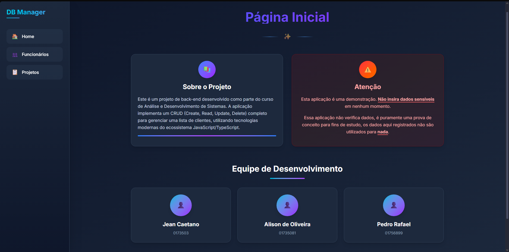
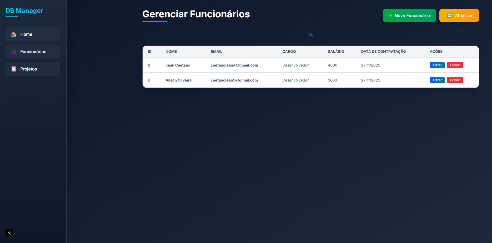
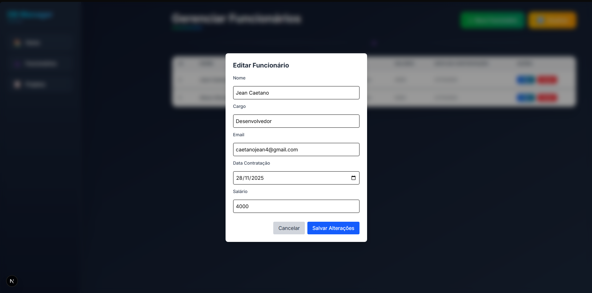
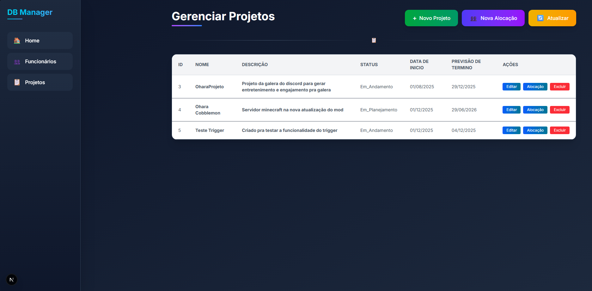
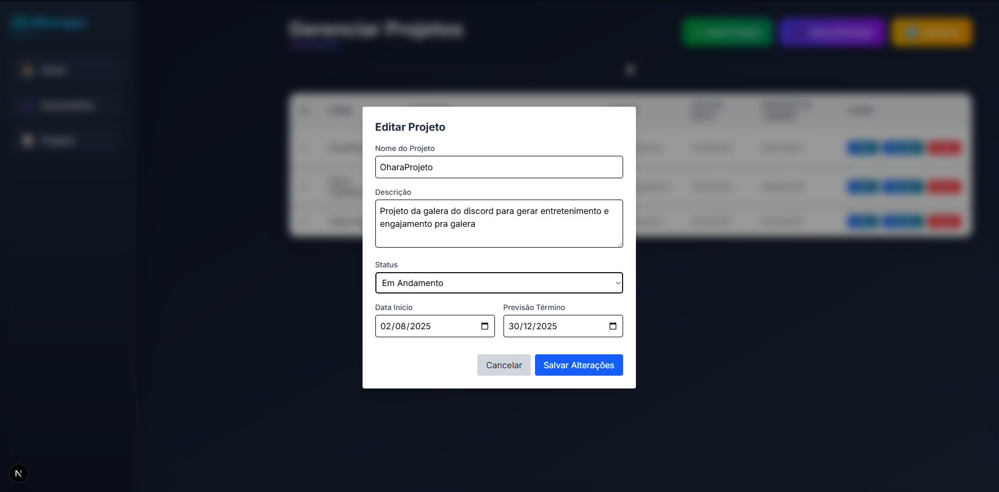
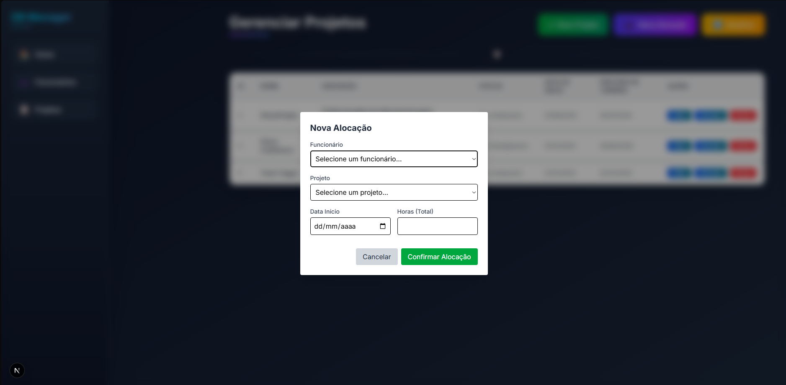

# 📌 DB CRUD — Frontend (Next.js)
## Equipe: Alison Oliveira - 01735081, Jean Caetano - 01735073, Rafael de Freitas - 01756899

Este é o frontend do sistema de gerenciamento de Funcionários, Projetos e Alocações, desenvolvido com Next.js e integrado ao backend via API REST.

A aplicação permite visualizar, cadastrar, editar e remover funcionários e projetos, além de gerenciar alocações.

## 🚀 Tecnologias Utilizadas

Next.js 14+

React

TypeScript

CSS (globals.css)

Fetch API para comunicação com backend

Componentização com arquivos .tsx

   
   
   
    📁 Estrutura do Projeto
    app/
    │
    ├── _components/               # Componentes reutilizáveis (tabelas, modais, barra de navegação)
    │   ├── BarraNavegacao.tsx
    │   ├── ListaFuncionarios.tsx
    │   ├── ListarProjetos.tsx
    │   ├── ModalAlocacoes.tsx
    │   ├── ModalEditarFuncionario.tsx
    │   ├── ModalEditarProjeto.tsx
    │   ├── ModalNovaAlocacao.tsx
    │   ├── ModalNovoFuncionario.tsx
    │   └── ModalNovoProjeto.tsx
    │
    ├── _hooks/                    # Hooks para acessar o backend
    │   ├── useAlocacoes.ts
    │   ├── useGetFuncionarios.ts
    │   └── useGetProjetos.ts
    │
    ├── pages/                     # Páginas principais
    │   ├── funcionarios/
    │   │     └── page.tsx         # Tela de CRUD de funcionários
    │   ├── projetos/
    │         └── page.tsx         # Tela de CRUD de projetos
    │
    ├── favicon.ico
    ├── globals.css                # Estilos globais
    ├── layout.tsx                 # Layout padrão da aplicação
    └── page.tsx                   # Página inicial

## 🖥️ Funcionalidades
✔ Página Inicial

Links para navegação entre Funcionários e Projetos.

✔ Funcionários

Listar todos os funcionários

Criar novo funcionário

Editar funcionário existente

Excluir funcionário

Modal de criação

Modal de edição

## Listagem via componente ListaFuncionarios.tsx

✔ Projetos

Listar todos os projetos

Criar novo projeto

Editar projeto

Excluir projeto

## Listagem via componente ListarProjetos.tsx

✔ Alocações

Criar nova alocação

Editar alocação

Excluir alocação

## Realizadas via ModalAlocacoes.tsx
